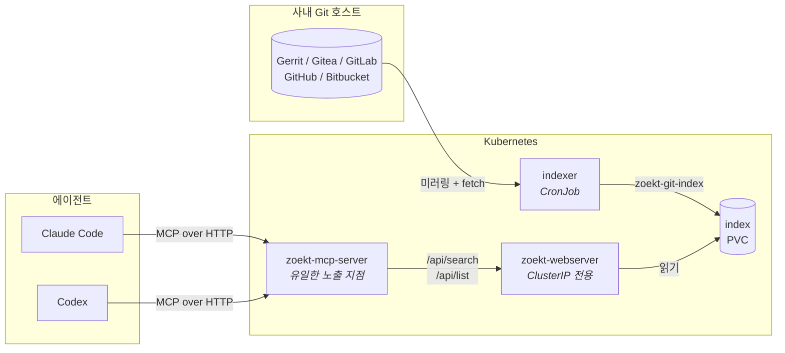

<!-- markdownlint-disable MD033 -->
# zoekt-mcp-server

코딩 에이전트용 사내 코드 검색 서버입니다. 사내 Git 호스트만 연결해 두면 Claude Code, Codex처럼
Model Context Protocol을 쓰는 도구에서 팀이 볼 수 있는 리포지터리를 전부 검색할 수 있습니다.

[English README](README.md)

## 왜 만들었나

코드를 볼 수 없는 에이전트는 추측으로 일합니다. 이미 있는 헬퍼를 또 만들고, 사내 API를 엉뚱하게
호출하고, 팀 코드 스타일과 동떨어진 코드를 씁니다.

흔히 파일을 컨텍스트 창에 붙여넣는 식으로 대응하지만, 리포지터리가 하나만 넘어가도 감당이 안 됩니다.
게다가 **어떤 파일을 붙여넣어야 하는지** 판단하는 일이 질문한 사람 몫이 되는데, 정작 그 판단이야말로
에이전트에게 맡기고 싶었던 일입니다.

## 아키텍처



| 구성 요소 | 역할 | 외부 노출 |
| --- | --- | --- |
| **indexer** | Git 호스트를 미러링하고 Zoekt 인덱스를 다시 만듦 | 없음 |
| **zoekt-webserver** | trigram 인덱스와 질의 엔진 | **없음 — ClusterIP 전용** |
| **zoekt-mcp-server** | MCP 툴 호출을 Zoekt 질의로 바꾸고 결과를 압축 | 있음. 이것만 노출 |

Zoekt에는 자체 인증이 없습니다. 접근만 되면 인덱싱된 리포지터리를 전부 읽을 수 있으므로, Zoekt Ingress를 붙이지 않습니다.

## 빠른 시작

```bash
helm install zoekt-mcp-server oci://ghcr.io/gyeonghokim/charts/zoekt-mcp-server \
  --namespace zoekt-mcp --create-namespace \
  --set indexer.hostKind=gerrit \
  --set indexer.hostURL=https://gerrit.example.com \
  --set indexer.credentials.existingSecret=zoekt-mcp-git \
  --set mcp.oidc.issuerURL=https://dex.example.com \
  --set mcp.oidc.audience=https://search.example.com/mcp/zoekt-mcp
```

`mcp.oidc.*` 두 값은 선택이 아닙니다. 토큰을 검증할 인가 서버가 없으면 `http` 전송은 기동하지
않습니다. [인증](#인증)을 보세요.

체크아웃한 소스에서 바로 설치할 수도 있습니다.

```bash
helm template zoekt-mcp-server deploy/helm -f deploy/helm/values-example-gerrit.yaml
helm install zoekt-mcp-server deploy/helm -f my-values.yaml -n zoekt-mcp --create-namespace
```

인덱서가 한 번 돌기 전까지 인덱스는 비어 있습니다. 스케줄을 기다리지 않고 바로 만들려면:

```bash
kubectl -n zoekt-mcp create job --from=cronjob/zoekt-mcp-server-indexer first-index
kubectl -n zoekt-mcp logs -f job/first-index
```

## 에이전트 연결

**Claude Code**

```bash
claude mcp add --transport http zoekt-mcp https://search.example.com/mcp/zoekt-mcp \
  --header "Authorization: Bearer $ZOEKT_MCP_TOKEN"
```

**Codex** — `~/.codex/config.toml`:

```toml
[mcp_servers.zoekt-mcp]
url = "https://search.example.com/mcp/zoekt-mcp"
# 연결할 때 읽어서 "Authorization: Bearer ..." 헤더로 보냅니다.
# 토큰이 config.toml에 남지 않습니다.
bearer_token_env_var = "ZOEKT_MCP_TOKEN"
```

`$ZOEKT_MCP_TOKEN`은 IdP가 제공하는 OAuth 2.1 그랜트로 받은 단기 액세스 토큰입니다. 머신
클라이언트라면 client-credentials가 가장 간단합니다. 운영자가 따로 나눠 주는 시크릿은 없습니다.
IdP에 인증할 수 있는 클라이언트라면 누구나 직접 발급받습니다. 자세한 내용은 [인증](#인증)을
보세요.

**로컬 stdio** — 클라이언트가 바이너리를 직접 실행하는 경우:

```json
{
  "command": "zoekt-mcp-server",
  "env": { "ZOEKT_MCP_UPSTREAM_URL": "http://127.0.0.1:6070" }
}
```

## 도구

| 도구 | 답하는 질문 |
| --- | --- |
| `search_code` | "이 문자열·정규식·패턴이 어디 있지?" — `repo:path:line`과 앞뒤 컨텍스트 라인을 돌려줍니다 |
| `read_file` | "그 파일 더 보여줘" — 줄 범위 지정. 이게 없으면 에이전트가 검색만 반복합니다 |
| `find_symbol` | "이 함수/타입은 어디서 정의했지?" — ctags 기반 `sym:` |
| `list_repos` | "여기 뭐가 있지?" — 질의 범위를 좁힐 때 |

결과는 돌려주기 전에 압축합니다. Zoekt가 주는 원본 `SearchResult`는 대부분 스코어링 메타데이터라서,
에이전트에게 `curl` 명령을 쥐여 주지 않고 굳이 서버를 두는 이유가 바로 이 압축을 누군가는 해야 하기
때문입니다. 토큰은 예산입니다.

`search_code`는 Zoekt의 [쿼리 문법](docs/zoekt/query-syntax.md)을 그대로 받습니다. `repo:`,
`file:`, `lang:`, `sym:`, 부정, 불리언 그룹핑 전부요. 그 위에 또 다른 쿼리 언어를 얹지 않은 것은
의도한 선택입니다.

**결과 개수나 컨텍스트 라인 수를 인자로 받는 도구는 없습니다.** 이 값은 환경변수로만 정합니다. 토큰
예산은 서버를 운영하는 쪽 것이고, 호출자가 올릴 수 있다면 `ZOEKT_MCP_MAX_RESULTS`는 상한이 아니라
기본값에 그치기 때문입니다. 더 필요하면 에이전트가 쿼리를 좁히거나 파일을 읽으면 됩니다. 검색
결과가 잘리면 첫 줄에 그 사실과 전체 매치 파일 수가 표시됩니다.

`read_file`은 한 번에 최대 400줄을 돌려주고 어디서부터 이어 읽으면 되는지 알려 줍니다. 토큰은
도착하는 순간 소비되는데, 호출자는 그 파일이 8,000줄짜리인지 읽어 보기 전엔 알 수 없습니다. 처음
400줄만 받으면 왕복이 한 번 늘어나는 데 그치지만, 전부 받아 버리면 되돌릴 수 없습니다.

`find_symbol`은 "그런 심볼이 없다"와 "이 인덱스로는 답할 수 없다"를 구분합니다. `sym:`은 인덱싱할
때 `$PATH`에 ctags가 있었을 때만 동작하고, ctags 없이 만든 인덱스는 심볼 질의에 에러 대신 빈
결과를 돌려줍니다. 그래서 매치가 없으면 이 도구는 대상 저장소에 심볼 데이터가 있는지 확인해서 없는
저장소를 알려 줍니다. `list_repos`도 같은 정보를 `symbols=yes` / `symbols=no`로 보여 주므로
에이전트가 묻기 전에 알 수 있습니다.

## 지원하는 Git 호스트

미러링은 Zoekt의 `zoekt-mirror-*` 도구가 맡으므로 지원 목록도 Zoekt를 따릅니다.

| 호스트 | `indexer.hostKind` | 비고 |
| --- | --- | --- |
| Gerrit | `gerrit` | 완전 연동: `-active`, `-name`, `-exclude`, `-http-credentials` |
| Gitea | `gitea` | 호스트별 플래그는 `indexer.extraMirrorArgs`로 |
| GitLab | `gitlab` | 호스트별 플래그는 `indexer.extraMirrorArgs`로 |
| GitHub | `github` | 호스트별 플래그는 `indexer.extraMirrorArgs`로 |
| Bitbucket Server | `bitbucket-server` | 호스트별 플래그는 `indexer.extraMirrorArgs`로 |
| 그 외 | `none` | `/data/repos`를 직접 채우면 CronJob은 재인덱싱만 합니다 |

미러 도구마다 플래그가 다릅니다. Gerrit은 `-active`, GitLab·GitHub은 `-token`, Bitbucket은
`-project`를 받습니다. 차트에 직접 연결해 둔 것은 Gerrit 플래그뿐인데, 실제 호스트로 확인해 본 것이
Gerrit이기 때문입니다. 다른 호스트는 `zoekt-mirror-<kind> -help`로 플래그를 확인해서
`indexer.extraMirrorArgs`로 넘기세요.

## 인증

`http` 전송은 OAuth 2.1 [Resource Server](https://datatracker.ietf.org/doc/rfc9728)로 동작합니다.
MCP 명세가 요구하는 형태가 바로 이것입니다. `ZOEKT_MCP_OIDC_ISSUER_URL`과
`ZOEKT_MCP_OIDC_AUDIENCE`가 없으면 아예 기동하지 않습니다. 자체 인증이 없는 인덱스로 가는 유일한
문이 이 서버이기 때문입니다.

기동할 때 인가 서버의 서명 키를 찾습니다. `ZOEKT_MCP_OIDC_ISSUER_URL` 아래의
`/.well-known/oauth-authorization-server` 또는 `/.well-known/openid-configuration`을 읽습니다.
`ZOEKT_MCP_OIDC_JWKS_URL`이 설정돼 있으면 탐색을 아예 건너뛰고 그 URL에서 키를 가져옵니다. 인가
서버가 메타데이터를 제공하지 않거나 `jwks_uri`가 잘못된 경우를 위한 값입니다. 그리고 클라이언트가 어디서
인증받아야 하는지 알 수 있도록 자체 `/.well-known/oauth-protected-resource` 메타데이터(RFC 9728)를
제공합니다. 모든 요청의 bearer 토큰은 JWT로 검증합니다. 찾아 둔 키로 서명을 확인하고, `iss`가 인가
서버와 같은지, `aud`에 audience가 들어 있는지, 만료되지 않았는지, RS256 또는 ES256으로 서명됐는지
봅니다. 토큰 헤더가 주장하는 알고리즘을 그대로 믿지 않는 것이 algorithm-confusion 공격을 막는
핵심입니다.

```bash
helm upgrade zoekt-mcp-server ... -n zoekt-mcp \
  --set mcp.oidc.issuerURL=https://dex.example.com \
  --set mcp.oidc.audience=https://search.example.com/mcp/zoekt-mcp
```

두 값 모두 비밀이 아닙니다. OAuth 클라이언트가 인증하려면 어차피 둘 다 알아야 하고, RFC 9728에
따라 그대로 공개되기도 합니다. 그래서 이 차트에는 Secret으로 넣어 둘 것이 없습니다.

PKCE, 로그인, 토큰 발급은 전부 MCP 클라이언트와 사내 IdP 사이에서 끝납니다. 이 서버는 자격 증명을
전혀 보지 않고, 그 플로우가 끝난 뒤 넘어오는 bearer 토큰만 봅니다. 호출자가 어떻게 인증했는지는 알
필요가 없고, 그 토큰이 해당 IdP가 이 서버 앞으로 발급한 것인지만 확인하면 됩니다. 그래서 이미 쓰고
있는 OAuth 2.1/OIDC IdP를 붙이는 데 코드 수준의 연동 작업이 필요 없습니다.

**다만 IdP 쪽 설정은 필요합니다.** 기본 설정 그대로 audience가 붙은 토큰을 내주는 IdP는 없었습니다.
이 서버로 테스트한 IdP는 전부 따로 설정하지 않으면 `aud: <호출자 자신의 client_id>`를 발급했고, 이런
토큰은 "`aud`에 `ZOEKT_MCP_OIDC_AUDIENCE`가 있어야 한다"는 검증에서 거부됩니다. 정확한 절차는
[IdP 설정](#idp-설정)에 Dex·Keycloak·Authentik 기준으로 확인한 내용을 적어 두었습니다.

일부러 하지 않는 것이 하나 있습니다. **레이트 리밋을 걸지 않습니다.** 탈취된 유효 토큰은 만료
전까지 재사용될 수 있으니, 인증 방식과 관계없이 앞단 게이트웨이에서 속도를 제한하세요
(`nginx.ingress.kubernetes.io/limit-rps` 또는 Traefik 미들웨어).

## IdP 설정

이 서버의 `aud` 검증을 통과하는, 실제로 *동작하는* 토큰을 받으려면 `ZOEKT_MCP_OIDC_ISSUER_URL`을
IdP로 가리키는 것 말고 한 단계가 더 필요합니다. IdP가 `ZOEKT_MCP_OIDC_AUDIENCE` 값을 토큰의 `aud`
클레임에 넣도록 설정해야 합니다. 방법은 IdP마다 다르고, 아래 세 IdP 모두 기본값으로는 꺼져 있습니다.
Dex는 실제 인스턴스로 끝까지 검증했고, Keycloak과 Authentik은 각 공식 문서로만 확인했습니다.
Authentik은 아래에 별도 주의 사항이 있습니다.

### Dex

Dex의 access token에는 기본적으로 `aud: <client_id>`가 들어갑니다. 리소스 식별자가 아닙니다.
리소스 기준 `aud`를 받으려면 Dex의
[cross-client trust](https://dexidp.io/docs/configuration/client-config/#cross-client-trust-and-authorized-party)
기능을 씁니다. MCP 서버를 두 번째 static client로 등록하되 *그 client의 ID를 리소스 식별자 그대로*
쓰고(Dex의 client ID는 그냥 불투명한 문자열이라 URL도 됩니다), 호출자 client가 이를 audience로
요청하게 합니다.

```yaml
# dex-config.yaml
staticClients:
  - id: your-agent-client
    secret: your-agent-secret
    redirectURIs:
      - "http://127.0.0.1:8081/callback"
  - id: "https://search.example.com/mcp/zoekt-mcp"   # 리소스 식별자를 그대로 client ID로 사용
    secret: unused-by-resource-clients
    public: true
    # 신뢰 방향은 peer -> caller입니다. 이 client가 *호출자의* client ID를
    # 나열해야 하고, 반대가 아닙니다.
    trustedPeers:
      - your-agent-client
```

호출자는 평소 scope에 `audience:server:client_id:<resource-id>` scope를 덧붙여 요청합니다. MCP
클라이언트는 authorization-code + PKCE 플로우 안에서 이를 알아서 처리합니다. 손으로 재현하려면
브라우저에서 인가 URL을 열어 로그인한 뒤, 돌려받은 code를 토큰으로 교환하면 됩니다.

```bash
# 1. 브라우저: 로그인하고 리다이렉트 URL의 `code`를 복사합니다.
open "https://dex.example.com/dex/auth?client_id=your-agent-client&response_type=code\
&redirect_uri=http://127.0.0.1:8081/callback\
&scope=openid%20profile%20email%20audience:server:client_id:https://search.example.com/mcp/zoekt-mcp"

# 2. 셸: code를 교환합니다. client secret은 명령줄이 아니라 환경변수에서 읽습니다.
curl -s -X POST https://dex.example.com/dex/token \
  -u "your-agent-client:$DEX_CLIENT_SECRET" \
  -d grant_type=authorization_code \
  -d redirect_uri=http://127.0.0.1:8081/callback \
  -d code="$CODE"
```

이렇게 받은 `access_token`의 `aud`는 리소스 식별자와 호출자 자신의 client ID를 둘 다 담은 배열이
됩니다. `jwt.WithAudience`(`internal/httpauth/claims.go` 참고)가 검사하는 게 바로 이 값입니다.
scope만 요청하면 Dex가 지원하는 어떤 grant든 똑같이 동작합니다. password grant는 RFC 9700이
금지하므로 일부러 싣지 않았습니다.

### Keycloak

Issuer는 `http://host:8080/realms/<realm>`, discovery는 `<issuer>/.well-known/openid-configuration`입니다.
Keycloak은 아직 RFC 8707 `resource` 요청 파라미터를 지원하지 않으므로
([keycloak/keycloak#41526](https://github.com/keycloak/keycloak/issues/41526)), 대신
**Audience 매퍼를 단 client scope**로 audience를 넣습니다.
[Keycloak이 MCP 서버용으로 직접 문서화한](https://www.keycloak.org/securing-apps/mcp-authz-server)
방법입니다.

1. **Client Scopes → Create client scope** — 이름은 `mcp:zoekt` 정도로, 타입은 **Optional**.
2. 그 scope 안에서 **Mappers → Configure a new mapper → Audience**.
3. **"Included Custom Audience"**에 `ZOEKT_MCP_OIDC_AUDIENCE`와 정확히 같은 값을 넣습니다.
   "Included Client Audience"는 등록된 다른 client만 고를 수 있으니 그쪽이 아닙니다.
4. **Clients → 해당 client → Client Scopes** — 이 scope를 **Optional**로 할당합니다.
5. 호출자가 명시적으로 요청해야 합니다: `scope=openid ... mcp:zoekt`. 빠뜨리면 `aud`에 리소스
   식별자 없이 오고, 이 서버는 그 토큰을 거부합니다.

### Authentik

Issuer: `https://authentik.company/application/o/<slug>/`. 끝의 슬래시에 주의하세요. Authentik은
토큰의 `iss`에도 이 슬래시를 넣는데, 이 서버는 issuer를 슬래시 유무와 관계없이 비교합니다.
Discovery: `<issuer>.well-known/openid-configuration`. JWKS: `<issuer>jwks/`.

**Signing Key부터 설정하세요. 안 하면 나머지는 의미가 없습니다.** Signing Key를 고르지 않으면
Authentik Provider는 토큰을 **HS256**으로 서명합니다. client secret을 키로 쓰는 대칭 서명입니다.
이 서버의 알고리즘 허용 목록(`internal/httpauth/claims.go`의 `allowedAlgs`)은 algorithm-confusion
공격을 막기 위해 RS256/ES256만 받으므로, 기본 설정의 Authentik provider가 발급한 토큰은 `aud`를
보기도 전에 서명 알고리즘 단계에서 거부됩니다. Provider 설정에서 RSA 또는 EC **Signing Key**를
명시적으로 선택하면 해결됩니다.

`aud` 클레임은 Authentik의
[Scope Mapping](https://docs.goauthentik.io/add-secure-apps/providers/property-mappings/)으로
넣습니다. 토큰 클레임에 병합할 dict를 돌려주는 Python 표현식으로, Authentik이 다른 커스텀
클레임에도 쓰는 일반적인 방법입니다.

```python
# Customization -> Property Mappings -> new Scope Mapping, provider에 연결
return {"aud": "https://search.example.com/mcp/zoekt-mcp"}
```

다만 위의 Dex·Keycloak과 달리, Authentik이 scope mapping으로 *예약된* `aud` 클레임을 덮어쓰게
해 주는지는 이 리포지터리에서 직접 확인하지 못했습니다. 단순히 커스텀 클레임을 추가하는 것과는 다를
수 있습니다. **이 단계는 그대로 믿지 말고, 실제로 받은 access token을 디코드해서 `aud`를
확인하세요.**

```bash
python3 -c "import base64,json,sys; print(json.dumps(json.loads(base64.urlsafe_b64decode(sys.argv[1].split('.')[1] + '=='))))" "$ACCESS_TOKEN"
```

## 접근 제어

**여기가 제대로 해야 하는 부분이고, 정규식은 답이 아닙니다.**

Zoekt 인덱스에는 리포지터리별 권한이라는 개념이 없습니다. 한번 인덱싱되면 MCP 서버를 호출할 수
있는 사람은 누구나 그 코드를 읽습니다. 그러니 질문은 "누가 검색할 수 있나"가 아니라 **"애초에
무엇을 인덱스에 넣나"**입니다.

**서비스 계정의 읽기 권한 자체를 화이트리스트로** 쓰세요.

1. Git 호스트에 전용 계정을 만듭니다. 예: `svc-zoekt-mcp`.
2. 에이전트에게 열어 줄 리포지터리에만 read 권한을 줍니다.
3. 인덱서에 그 계정의 자격 증명을 넣습니다.

이렇게 하면 `indexer.include` / `indexer.exclude`는 노이즈를 걸러 내는 2차 방어선이 됩니다.
정규식을 잘못 써도 최악의 경우 리포지터리가 빠질 뿐 새어 나가진 않습니다. 클론 자체가 실패하기
때문입니다. 반대로 정규식에만 기대면 오타 하나에 범위가 조용히 넓어지고, 다음 주에 새로 생긴
리포지터리는 기본적으로 포함됩니다.

호출자마다 다르게 필터링해야 한다면, 그러니까 엔지니어마다 보이는 리포지터리가 달라야 한다면, 그건
MCP 서버가 할 일이고 토큰별로 `repo:` 필터를 주입하는 방식이 됩니다. 지금 차트에는 이 기능이
없습니다.

## 설정

서버는 환경변수로만 설정하며, 차트가 이를 대신 채워 줍니다.

| 변수 | 기본값 | 역할 |
| --- | --- | --- |
| `ZOEKT_MCP_UPSTREAM_URL` | *(필수)* | `-rpc`로 띄운 `zoekt-webserver`의 base URL |
| `ZOEKT_MCP_TRANSPORT` | `stdio` | `stdio` 또는 `http` |
| `ZOEKT_MCP_ADDR` | `127.0.0.1:8080` | 리슨 주소. `http` 전송에서만 사용 |
| `ZOEKT_MCP_OIDC_ISSUER_URL` | *(`http`에서 필수)* | OAuth 2.1 인가 서버의 base URL |
| `ZOEKT_MCP_OIDC_AUDIENCE` | *(`http`에서 필수)* | 이 서버의 리소스 식별자. `aud` claim에 반드시 들어 있어야 함 |
| `ZOEKT_MCP_OIDC_JWKS_URL` | *(선택)* | 서명 키 엔드포인트를 자동 탐색 대신 직접 지정 |
| `ZOEKT_MCP_TIMEOUT` | `30s` | Zoekt 요청 하나의 제한 시간 |
| `ZOEKT_MCP_MAX_RESULTS` | `50` | 검색당 파일 매치 상한 (최대 500) |
| `ZOEKT_MCP_CONTEXT_LINES` | `3` | 매치 앞뒤로 보여 줄 줄 수 (최대 50) |

검색 한 번의 비용은 `ZOEKT_MCP_CONTEXT_LINES`가 정합니다. 3줄이면 매치를 알아보기에 충분하고,
10줄이면 함수를 읽을 수 있지만 토큰은 대략 세 배가 됩니다.

## 개발

```bash
mise trust && mise install   # 고정된 툴체인 -- mise.toml 참조
just setup                   # git hook
just dev-up                  # 이 리포지터리를 인덱싱한 로컬 Zoekt
just ci                      # CI가 돌리는 전부
```

나머지는 `just --list`로 확인하세요. 모든 레시피는 Linux·macOS·Windows에서 동작합니다.

`just dev-up`은 Zoekt만 띄우므로 `http` 전송의 OAuth 가드는 건드리지 않습니다. 로컬에서
확인하려면 [IdP 설정 → Dex](#dex)의 설정으로 임시 Dex를 띄우세요. 메타데이터 엔드포인트만 보는 게
아니라 이 서버가 실제로 받아 주는 토큰까지 얻을 수 있습니다.

```bash
docker run --rm -p 5556:5556 -v "$PWD/dex-config.yaml:/etc/dex/config.yaml" dexidp/dex:latest \
  serve /etc/dex/config.yaml

ZOEKT_MCP_UPSTREAM_URL=http://127.0.0.1:6070 \
ZOEKT_MCP_TRANSPORT=http \
ZOEKT_MCP_ADDR=127.0.0.1:8081 \
ZOEKT_MCP_OIDC_ISSUER_URL=http://127.0.0.1:5556/dex \
ZOEKT_MCP_OIDC_AUDIENCE=https://search.example.com/mcp/zoekt-mcp \
just run

curl -s http://127.0.0.1:8081/.well-known/oauth-protected-resource | jq .
```

기여할 때 지킬 규약과 레이어 규칙은 [AGENTS.md](AGENTS.md)에 있습니다. 에이전트를 위해 쓴
문서지만 사람이 읽어도 그대로 통합니다.

## 라이선스

Apache-2.0. [LICENSE](LICENSE)와 [NOTICE](NOTICE)를 참조하세요.

`docs/zoekt/` 아래 벤더링된 Zoekt 참조 자료의 저작권은 Zoekt 저자들에게 있으며, 마찬가지로
Apache-2.0입니다.
