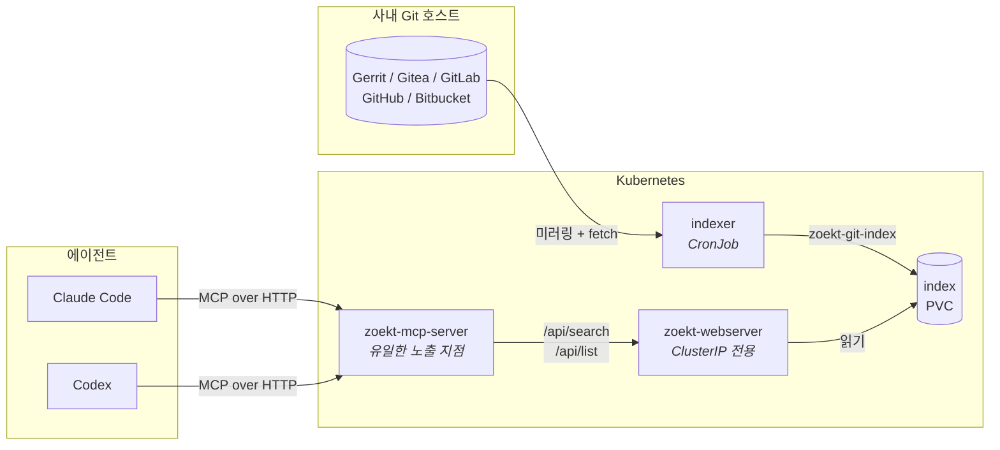

<!-- markdownlint-disable MD033 -->
# zoekt-mcp-server

코딩 에이전트를 위한 self-hosted 코드 검색. 사내 Git 호스트만 연결하면 Claude Code, Codex 등
Model Context Protocol을 쓰는 모든 도구가 팀이 볼 수 있는 모든 리포지터리를 검색할 수 있습니다.

[English README](README.md)

## 왜 만들었나

코드를 못 보는 에이전트는 추측합니다. 이미 있는 헬퍼를 다시 만들고, 사내 API를 엉뚱한 형태로
호출하고, 팀의 코딩 방식과 안 맞는 코드를 씁니다.

흔한 대응은 파일을 컨텍스트 창에 붙여넣는 것입니다. 리포지터리 하나를 넘어가면 확장이 안 되고,
**어느 파일을 붙여넣어야 하는지 아는 부담**을 질문한 사람에게 떠넘깁니다 — 정작 그 판단이야말로
에이전트가 대신해주길 바랐던 일인데요.

[Zoekt](https://github.com/sourcegraph/zoekt)를 감싸는 MCP 서버는 이미 존재합니다. 없는 것은 그
주변 전부입니다: 사내 Git 호스트에서 수백 개 리포지터리를 미러링하고, 인덱스를 갱신하고,
클러스터에 얹고, 권한 없는 코드까지 열어주지 않으면서 에이전트에 노출하는 것. 실제 작업량은 거기에
있고, 이 리포지터리가 바로 그것입니다.

## 아키텍처



구성 요소는 셋이고, 그 사이의 경계가 곧 설계입니다:

| 구성 요소 | 역할 | 외부 노출 |
| --- | --- | --- |
| **indexer** | Git 호스트를 미러링하고 Zoekt 인덱스를 재생성 | 아니오 |
| **zoekt-webserver** | trigram 인덱스와 질의 엔진 | **아니오 — ClusterIP 전용** |
| **zoekt-mcp-server** | MCP 툴 호출을 Zoekt 질의로 번역하고 결과를 압축 | 예, 그리고 이것만 |

Zoekt에는 자체 인증이 없습니다. 접근할 수 있으면 인덱싱된 모든 리포지터리를 읽을 수 있으므로,
차트는 Zoekt에 Ingress를 붙이지 않으며 붙여서도 안 됩니다. MCP 서버가 유일한 정문이고, 그래서
인증과 감사 로그가 놓일 자리도 거기입니다.

## 빠른 시작

```bash
helm install zoekt-mcp-server oci://ghcr.io/gyeonghokim/charts/zoekt-mcp-server \
  --namespace zoekt-mcp --create-namespace \
  --set indexer.hostKind=gerrit \
  --set indexer.hostURL=https://gerrit.example.com \
  --set indexer.credentials.existingSecret=zoekt-mcp-git
```

체크아웃에서 직접 설치할 수도 있습니다. 무엇이 생성될지 먼저 확인하는 방법이기도 합니다:

```bash
helm template zoekt-mcp-server deploy/helm -f deploy/helm/values-example-gerrit.yaml
helm install zoekt-mcp-server deploy/helm -f my-values.yaml -n zoekt-mcp --create-namespace
```

인덱서가 한 번 돌기 전까지 인덱스는 비어 있습니다. 스케줄을 기다리지 않고 지금 만들려면:

```bash
kubectl -n zoekt-mcp create job --from=cronjob/zoekt-mcp-server-indexer first-index
kubectl -n zoekt-mcp logs -f job/first-index
```

## 에이전트 연결

**Claude Code**

```bash
claude mcp add --transport http zoekt-mcp https://search.example.com/mcp/zoekt-mcp \
  --header "Authorization: Bearer $ZOEKT_MCP_AUTH_TOKEN"
```

**Codex** — `~/.codex/config.toml`:

```toml
[mcp_servers.zoekt-mcp]
url = "https://search.example.com/mcp/zoekt-mcp"
# 연결 시점에 읽어 "Authorization: Bearer ..." 로 보냅니다. 토큰이
# config.toml 에 남지 않습니다.
bearer_token_env_var = "ZOEKT_MCP_AUTH_TOKEN"
```

**로컬 stdio** — 클라이언트가 바이너리를 직접 실행하는 경우:

```json
{
  "command": "zoekt-mcp-server",
  "env": { "ZOEKT_MCP_UPSTREAM_URL": "http://127.0.0.1:6070" }
}
```

## 도구

| 도구 | 답하는 질문 |
| --- | --- |
| `search_code` | "이 문자열·정규식·패턴이 어디 있나?" — `repo:path:line` 과 앞뒤 컨텍스트 라인 반환 |
| `read_file` | "그 파일을 더 보여줘" — 줄 범위 지정. 이게 없으면 에이전트가 검색을 반복합니다 |
| `find_symbol` | "이 함수/타입은 어디서 정의됐나?" — ctags 기반 `sym:` |
| `list_repos` | "여기 뭐가 들어있나?" — 질의 범위를 좁히기 위해 |

결과는 반환 전에 압축됩니다. Zoekt의 원시 `SearchResult`는 대부분 스코어링 메타데이터이고,
에이전트에게 `curl` 명령을 쥐여주는 대신 서버를 두는 이유가 바로 그 압축을 누군가 해야 하기
때문입니다. 토큰은 예산입니다.

`search_code`는 Zoekt 자체 [쿼리 문법](docs/zoekt/query-syntax.md)을 그대로 받습니다 — `repo:`,
`file:`, `lang:`, `sym:`, 부정, 불리언 그룹핑. 그 위에 두 번째 쿼리 언어를 얹지 않는 것은 의도된
선택입니다.

**결과 개수나 컨텍스트 라인 수를 받는 도구는 없습니다.** 이 값들은 환경변수에서만 옵니다. 토큰
예산은 서버를 운영하는 쪽의 것이고, 호출자가 올릴 수 있다면 `ZOEKT_MCP_MAX_RESULTS`는 상한이
아니라 기본값에 불과해지기 때문입니다. 더 필요한 에이전트는 쿼리를 좁히거나 파일을 읽습니다.
검색 결과가 잘리면 첫 줄이 그 사실과 전체 매치 파일 수를 알려줍니다.

`read_file`은 한 번에 최대 400줄을 반환하고 어디서 이어 읽을지 알려줍니다. 토큰은 도착하는 순간
소비되고, 호출자는 그 파일이 8,000줄인지 물어보기 전에 알 수 없습니다. 처음 400줄만 받으면 왕복이
한 번 늘어날 뿐이지만, 전부 받으면 되돌릴 수 없습니다.

`find_symbol`은 "그런 심볼이 없음"과 "이 인덱스는 답할 수 없음"을 구분합니다. `sym:`은 인덱싱
시점에 `$PATH`에 ctags가 있었을 때만 매치되고, 없이 만든 인덱스는 심볼 질의에 에러가 아니라
침묵으로 답합니다. 매치가 없으면 이 도구는 대상 저장소가 심볼 데이터를 갖고 있는지 확인해서 없는
저장소를 알려줍니다. `list_repos`도 같은 정보를 `symbols=yes` / `symbols=no`로 표시하므로,
에이전트가 묻기 전에 알 수 있습니다.

## 지원하는 Git 호스트

미러링은 Zoekt의 `zoekt-mirror-*` 도구가 담당하므로, 지원 목록은 Zoekt의 것입니다:

| 호스트 | `indexer.hostKind` | 비고 |
| --- | --- | --- |
| Gerrit | `gerrit` | 완전 연동: `-active`, `-name`, `-exclude`, `-http-credentials` |
| Gitea | `gitea` | 호스트별 플래그는 `indexer.extraMirrorArgs` 로 |
| GitLab | `gitlab` | 호스트별 플래그는 `indexer.extraMirrorArgs` 로 |
| GitHub | `github` | 호스트별 플래그는 `indexer.extraMirrorArgs` 로 |
| Bitbucket Server | `bitbucket-server` | 호스트별 플래그는 `indexer.extraMirrorArgs` 로 |
| 그 외 | `none` | `/data/repos` 를 직접 채우면 CronJob은 재인덱싱만 수행 |

미러 도구들은 플래그 집합을 공유하지 않습니다 — Gerrit은 `-active`, GitLab·GitHub은 `-token`,
Bitbucket은 `-project` 를 받습니다. 차트에 직접 배선한 것은 Gerrit 플래그뿐인데, 실제 호스트에
대해 확인한 것이 그것이기 때문입니다. 다른 호스트는 `zoekt-mirror-<kind> -help` 를 확인해
`indexer.extraMirrorArgs` 로 넘기세요.

## 인증

`http` 전송은 `ZOEKT_MCP_AUTH_TOKEN` 없이는 기동을 거부하고, 그 토큰을 bearer로 제시하지 않은
요청에는 `401` 을 돌려줍니다. 끄는 설정은 없습니다. 이 서버가 자체 인증이 없는 인덱스로 향하는
유일한 정문이기 때문입니다.

```bash
kubectl create secret generic zoekt-mcp-token -n zoekt-mcp \
  --from-literal=token="$(openssl rand -base64 32)"

helm upgrade zoekt-mcp-server ... -n zoekt-mcp --set mcp.auth.existingSecret=zoekt-mcp-token
```

값은 **콤마로 구분된 목록**입니다. 이것이 모든 호출자가 한꺼번에 끊기는 구간 없이 토큰을 회전할 수
있게 해 줍니다 — 새 토큰을 추가하고, 엔지니어들이 옮겨 가게 한 뒤, 옛 토큰을 제거합니다.

의도적으로 하지 않는 것이 둘 있습니다. **레이트 리밋을 걸지 않습니다** — 정적 토큰은 정문이 허용하는
속도만큼 추측당하므로, 제한은 거기서 거세요 (`nginx.ingress.kubernetes.io/limit-rps` 또는 Traefik
미들웨어). 그리고 **누구인지 식별하지 않습니다** — 토큰을 가진 모든 호출자는 동일한 호출자이므로,
감사 기록에 남는 것은 "누가"가 아니라 "그 토큰"입니다.

둘 다 OAuth 2.1이 답이고, MCP 명세가 실제로 요구하는 형태도 그것입니다 — 서버가 사내 IdP의 토큰을
검증하는 Resource Server가 됩니다. 지금 배선도 이미 SDK의 `auth.RequireBearerToken` 이므로, 그
전환은 `internal/httpauth` 의 `auth.TokenVerifier` 하나를 교체하는 것으로 끝나고 나머지는 그대로
남습니다. 가리킬 인가 서버가 생기기 전까지는 정적 토큰이 정직한 분량의 장치입니다.

## 접근 제어

**여기가 제대로 해야 하는 부분이고, 정규식은 그 답이 아닙니다.**

Zoekt 인덱스에는 리포지터리별 권한 개념이 없습니다. 한번 인덱싱되면 MCP 서버를 호출할 수 있는
누구나 그 코드를 읽습니다. 그러므로 질문은 "누가 검색할 수 있나"가 아니라 **"애초에 무엇이
인덱스에 들어가나"** 입니다.

**서비스 계정의 읽기 권한 자체를 화이트리스트로** 삼으세요:

1. Git 호스트에 전용 계정을 만듭니다 — `svc-zoekt-mcp` 등.
2. 에이전트에게 노출할 리포지터리에만 read 권한을 부여합니다.
3. 인덱서에 그 계정의 자격 증명을 줍니다.

그러면 `indexer.include` / `indexer.exclude` 는 노이즈를 걸러내는 2차 방어선이 됩니다. 정규식을
틀려도 최악의 결과는 리포지터리가 빠지는 것이지 새어 나가는 것이 아닙니다 — 클론 자체가 실패하기
때문입니다. 반대로 정규식에만 의존하면 오타 하나가 조용히 범위를 넓히고, 다음 주에 생긴
리포지터리는 기본적으로 포함됩니다.

호출자별 필터링이 정말 필요하다면 — 엔지니어마다 보이는 리포지터리가 달라야 한다면 — 그것은 MCP
서버의 몫이고, 토큰별로 `repo:` 필터를 주입하는 방식이 됩니다. 현재 차트는 이를 제공하지 않습니다.

## 설정

서버 자체는 전적으로 환경변수로 설정되며, 차트가 대신 채워 줍니다.

| 변수 | 기본값 | 역할 |
| --- | --- | --- |
| `ZOEKT_MCP_UPSTREAM_URL` | *(필수)* | `-rpc` 로 띄운 `zoekt-webserver` 의 base URL |
| `ZOEKT_MCP_TRANSPORT` | `stdio` | `stdio` 또는 `http` |
| `ZOEKT_MCP_ADDR` | `127.0.0.1:8080` | 리슨 주소, `http` 전송에만 사용 |
| `ZOEKT_MCP_AUTH_TOKEN` | *(`http` 에서 필수)* | 호출자가 제시해야 하는 bearer 토큰, 콤마 구분 |
| `ZOEKT_MCP_TIMEOUT` | `30s` | Zoekt 요청 하나의 시간 제한 |
| `ZOEKT_MCP_MAX_RESULTS` | `50` | 검색당 파일 매치 상한 (최대 500) |
| `ZOEKT_MCP_CONTEXT_LINES` | `3` | 매치 주변 라인 수 (최대 50) |

`ZOEKT_MCP_CONTEXT_LINES` 가 검색 한 번의 비용을 결정합니다. 3줄이면 매치를 알아보기에 충분하고,
10줄이면 함수를 읽을 수 있지만 토큰이 대략 세 배가 됩니다.

## 개발

```bash
mise trust && mise install   # 고정된 툴체인 -- mise.toml 참조
just setup                   # git hook
just dev-up                  # 이 리포지터리를 인덱싱한 로컬 Zoekt
just ci                      # CI가 돌리는 전부
```

나머지는 `just --list` 로 확인하세요. 모든 레시피는 Linux·macOS·Windows에서 동작합니다.

기여 시 지켜야 할 규약과 레이어 규칙은 [AGENTS.md](AGENTS.md)에 있습니다 — 에이전트를 위해 썼지만
사람이 읽기에도 그대로 쓸 수 있습니다.

## 라이선스

Apache-2.0. [LICENSE](LICENSE)와 [NOTICE](NOTICE)를 참조하세요.

`docs/zoekt/` 아래 벤더링된 Zoekt 참조 자료의 저작권은 Zoekt 저자들에게 있으며, 동일하게
Apache-2.0 입니다.
