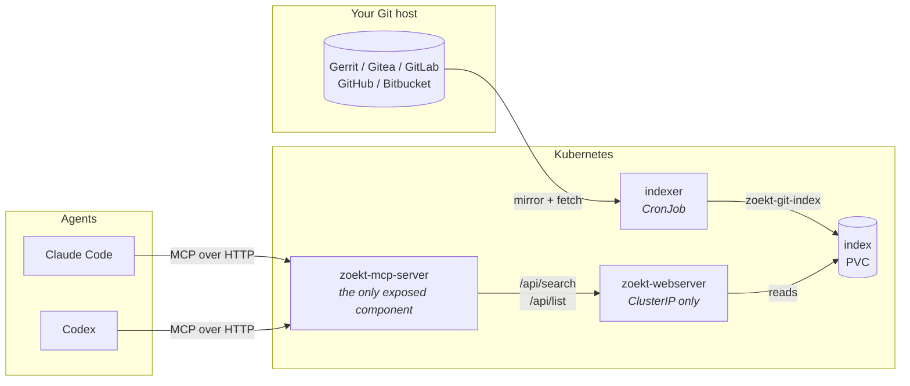

<!-- markdownlint-disable MD033 -->
# zoekt-mcp-server

Self-hosted code search for coding agents. Point it at your internal Git host and your agents can
search every repository your team can read — from Claude Code, Codex, or anything else that speaks
the Model Context Protocol.

[한국어 README](README.ko.md)

## Why this exists

An agent that cannot see your code guesses at it. It reinvents a helper you already have, calls an
internal API with the wrong shape, and writes code that does not match how your team writes code.

The usual answer is to paste files into the context window. That does not scale past one repository,
and it puts the burden of knowing *which* file to paste on the person who asked the question — which
is exactly the thing they wanted the agent to work out.

## Architecture



| Component | What it does | Exposed? |
| --- | --- | --- |
| **indexer** | Mirrors your Git host, then rebuilds the Zoekt index | No |
| **zoekt-webserver** | Trigram index and query engine | **No — ClusterIP only** |
| **zoekt-mcp-server** | Translates MCP tool calls into Zoekt queries and compacts the results | Yes, and only this |

Zoekt has no authentication of its own. Anything that can reach it can read every repository you
indexed, so the chart never gives it an Ingress and neither should you. The MCP server is the single
front door, which is also what makes it the natural place for authentication and audit logging.

## Quick start

```bash
helm install zoekt-mcp-server oci://ghcr.io/gyeonghokim/charts/zoekt-mcp-server \
  --namespace zoekt-mcp --create-namespace \
  --set indexer.hostKind=gerrit \
  --set indexer.hostURL=https://gerrit.example.com \
  --set indexer.credentials.existingSecret=zoekt-mcp-git \
  --set mcp.oidc.issuerURL=https://dex.example.com \
  --set mcp.oidc.audience=https://search.example.com/mcp/zoekt-mcp
```

The two `mcp.oidc.*` values are not optional: the `http` transport refuses to start without an
authorization server to verify tokens against. See [Authentication](#authentication).

Or from a checkout, which is also how you review what it will create:

```bash
helm template zoekt-mcp-server deploy/helm -f deploy/helm/values-example-gerrit.yaml
helm install zoekt-mcp-server deploy/helm -f my-values.yaml -n zoekt-mcp --create-namespace
```

The index is empty until the indexer has run. To build it now rather than waiting for the schedule:

```bash
kubectl -n zoekt-mcp create job --from=cronjob/zoekt-mcp-server-indexer first-index
kubectl -n zoekt-mcp logs -f job/first-index
```

## Connecting an agent

**Claude Code**

```bash
claude mcp add --transport http zoekt-mcp https://search.example.com/mcp/zoekt-mcp \
  --header "Authorization: Bearer $ZOEKT_MCP_TOKEN"
```

**Codex** — in `~/.codex/config.toml`:

```toml
[mcp_servers.zoekt-mcp]
url = "https://search.example.com/mcp/zoekt-mcp"
# Read at connect time and sent as "Authorization: Bearer ...", so the token
# stays out of config.toml.
bearer_token_env_var = "ZOEKT_MCP_TOKEN"
```

`$ZOEKT_MCP_TOKEN` is a short-lived access token obtained from whatever OAuth 2.1 grant your
identity provider offers a machine client — client-credentials is the simplest fit for a CLI
integration like this. There is no operator-issued secret to distribute: any client that can
authenticate against your IdP as an authorized caller can obtain one on its own. See
[Authentication](#authentication).

**Locally, over stdio** — for a client that spawns the binary itself:

```json
{
  "command": "zoekt-mcp-server",
  "env": { "ZOEKT_MCP_UPSTREAM_URL": "http://127.0.0.1:6070" }
}
```

## Tools

| Tool | What it answers |
| --- | --- |
| `search_code` | "Where is this string, regex or pattern?" — returns `repo:path:line` plus context lines |
| `read_file` | "Show me more of that file" — a line range, so the agent stops re-searching to see context |
| `find_symbol` | "Where is this function/type defined?" — `sym:`, backed by ctags |
| `list_repos` | "What is even in here?" — so an agent can scope a query before running it |

Results are compacted before they are returned. A raw Zoekt `SearchResult` is mostly scoring
metadata, and the reason to run a server rather than hand an agent a `curl` command is that
something has to do that compaction. Tokens are a budget.

`search_code` takes Zoekt's own [query syntax](docs/zoekt/query-syntax.md) — `repo:`, `file:`,
`lang:`, `sym:`, negation, boolean grouping. There is deliberately no second query language layered
on top of it.

**No tool takes a result limit or a context-line count.** Those come from the environment, because
the token budget belongs to whoever runs the server: a caller that could raise them would make
`ZOEKT_MCP_MAX_RESULTS` a default rather than a ceiling. An agent that wants more narrows the
query or reads the file. When a search is truncated, the first line says so and how many files
matched in total.

`read_file` returns at most 400 lines per call and says where to resume. Tokens are spent the
moment they arrive, and a caller cannot know a file is eight thousand lines before asking; being
handed the first 400 costs one more round trip, being handed all of it cannot be undone.

`find_symbol` distinguishes "no such symbol" from "this index cannot answer that". `sym:` only
matches when the index was built with ctags on `$PATH`, and Zoekt answers a symbol query on an
index without it with silence rather than an error. When nothing matches, the tool checks whether
the repositories carry symbol data and says which do not. `list_repos` reports the same thing as
`symbols=yes` or `symbols=no`, so an agent can tell before it asks.

## Supported Git hosts

Mirroring is done by Zoekt's own `zoekt-mirror-*` tools, so the list is theirs:

| Host | `indexer.hostKind` | Notes |
| --- | --- | --- |
| Gerrit | `gerrit` | Fully wired: `-active`, `-name`, `-exclude`, `-http-credentials` |
| Gitea | `gitea` | Set host flags via `indexer.extraMirrorArgs` |
| GitLab | `gitlab` | Set host flags via `indexer.extraMirrorArgs` |
| GitHub | `github` | Set host flags via `indexer.extraMirrorArgs` |
| Bitbucket Server | `bitbucket-server` | Set host flags via `indexer.extraMirrorArgs` |
| Anything else | `none` | Populate `/data/repos` yourself; the CronJob only reindexes |

The mirror tools do not share one flag set — Gerrit takes `-active`, GitLab and GitHub take
`-token`, Bitbucket takes `-project`. Only the Gerrit flags are wired into the chart directly,
because those are the ones verified against a real host. For any other host, run
`zoekt-mirror-<kind> -help` and pass what it wants through `indexer.extraMirrorArgs`.

## Authentication

The `http` transport is an OAuth 2.1 [Resource Server](https://datatracker.ietf.org/doc/rfc9728),
which is what the MCP specification asks for. It refuses to start without
`ZOEKT_MCP_OIDC_ISSUER_URL` and `ZOEKT_MCP_OIDC_AUDIENCE`, because this server is the only front
door to an index that has no authentication of its own.

At startup it discovers the authorization server's signing keys via
`ZOEKT_MCP_OIDC_ISSUER_URL`'s `/.well-known/oauth-authorization-server` or
`/.well-known/openid-configuration`. If `ZOEKT_MCP_OIDC_JWKS_URL` is set, discovery is skipped
entirely and the keys are fetched from that URL — for authorization servers that publish no
metadata, or publish the wrong `jwks_uri`. It also serves its own
`/.well-known/oauth-protected-resource` metadata (RFC 9728) so a client can discover where to
authenticate. Every request's bearer token is verified as a JWT: signature against the discovered
keys, `iss` equal to the issuer, `aud` containing the audience, not expired, and signed with RS256
or ES256 — never trusting whatever algorithm the token's own header claims, which is what closes
the classic algorithm-confusion hole.

```bash
helm upgrade zoekt-mcp-server ... -n zoekt-mcp \
  --set mcp.oidc.issuerURL=https://dex.example.com \
  --set mcp.oidc.audience=https://search.example.com/mcp/zoekt-mcp
```

Neither value is secret — an OAuth client needs both to authenticate at all, and RFC 9728 publishes
them anyway. There is nothing here for this chart to keep in a Secret.

PKCE, login, and token issuance all happen between the MCP client and your identity provider; this
server never sees a credential, only the bearer token that flow ends with. Nothing here needs to be
aware of how a caller authenticated, only that the token it presents was issued, for this server, by
that IdP — so an existing OAuth 2.1/OIDC IdP needs no code-level integration work.

**It does need IdP-side configuration, though.** No IdP hands out an audience-scoped token by
default — every one tested against this server issues `aud: <the caller's own client_id>` until
told otherwise, which this server's `aud`-must-contain-`ZOEKT_MCP_OIDC_AUDIENCE` check rejects. See
[Identity provider setup](#identity-provider-setup) for the exact steps, verified against Dex,
Keycloak and Authentik.

One thing this deliberately does not do: rate limit. A stolen still-valid token can be replayed
until it expires, so bound request rate at your front door (`nginx.ingress.kubernetes.io/limit-rps`
or your Traefik middleware) regardless of authentication scheme.

## Identity provider setup

Getting a *working* token — one this server's `aud` check accepts — takes one extra step beyond
pointing `ZOEKT_MCP_OIDC_ISSUER_URL` at your IdP: telling the IdP to put your `ZOEKT_MCP_OIDC_AUDIENCE`
value into the token's `aud` claim. That step is IdP-specific and, on every IdP below, off by
default. The Dex recipe was verified end to end against a running instance; the Keycloak and
Authentik recipes were checked against their current documentation only, and the Authentik one
carries a caveat of its own below.

### Dex

Dex's access tokens carry `aud: <client_id>` by default — not a resource identifier. Getting a
resource-scoped `aud` uses Dex's own [cross-client trust](https://dexidp.io/docs/configuration/client-config/#cross-client-trust-and-authorized-party) mechanism: register the MCP server itself as a second static client,
*using the resource identifier as that client's ID* (Dex client IDs are just opaque strings, so a
URL is a legal one), and have the caller's client request it as an audience.

```yaml
# dex-config.yaml
staticClients:
  - id: your-agent-client
    secret: your-agent-secret
    redirectURIs:
      - "http://127.0.0.1:8081/callback"
  - id: "https://search.example.com/mcp/zoekt-mcp"   # the resource identifier itself, as a client ID
    secret: unused-by-resource-clients
    public: true
    # Trust runs peer -> caller, not the other way around: this client must
    # list the *caller's* client ID, not the reverse.
    trustedPeers:
      - your-agent-client
```

The caller then requests the scope `audience:server:client_id:<resource-id>` alongside its normal
scopes. An MCP client does this for you inside its authorization-code + PKCE flow; to reproduce it
by hand, open the authorization URL in a browser, log in, and exchange the returned code:

```bash
# 1. Browser: log in and copy the `code` from the redirect.
open "https://dex.example.com/dex/auth?client_id=your-agent-client&response_type=code\
&redirect_uri=http://127.0.0.1:8081/callback\
&scope=openid%20profile%20email%20audience:server:client_id:https://search.example.com/mcp/zoekt-mcp"

# 2. Shell: exchange it. The client secret comes from the environment, not the command line.
curl -s -X POST https://dex.example.com/dex/token \
  -u "your-agent-client:$DEX_CLIENT_SECRET" \
  -d grant_type=authorization_code \
  -d redirect_uri=http://127.0.0.1:8081/callback \
  -d code="$CODE"
```

The resulting `access_token`'s `aud` is an array containing both the resource identifier and the
caller's own client ID — which is what `jwt.WithAudience` (see `internal/httpauth/claims.go`)
checks against. Any grant Dex supports works the same way as long as the scope is requested; the
password grant is deliberately not shown, since RFC 9700 forbids it.

### Keycloak

Issuer: `http://host:8080/realms/<realm>`; discovery at `<issuer>/.well-known/openid-configuration`.
Keycloak does not yet support the RFC 8707 `resource` request parameter
([keycloak/keycloak#41526](https://github.com/keycloak/keycloak/issues/41526)), so audience
restriction goes through a **client scope with an Audience mapper** instead — this is
[documented by Keycloak itself for MCP servers specifically](https://www.keycloak.org/securing-apps/mcp-authz-server):

1. **Client Scopes → Create client scope** — name it something like `mcp:zoekt`, type **Optional**.
2. In that scope: **Mappers → Configure a new mapper → Audience**.
3. Set **"Included Custom Audience"** (not "Included Client Audience", which only accepts another
   registered client) to the exact value of `ZOEKT_MCP_OIDC_AUDIENCE`.
4. **Clients → your client → Client Scopes** — assign the scope as **Optional**.
5. The caller must request it explicitly: `scope=openid ... mcp:zoekt`. Left off, `aud` comes back
   without the resource identifier and this server rejects the token.

### Authentik

Issuer/JWKS: `https://authentik.company/application/o/<slug>/.well-known/openid-configuration`.

**Set a Signing Key first, or nothing else here matters.** With no Signing Key selected, an
Authentik Provider signs tokens **HS256** — symmetrically, keyed on the client secret. This
server's algorithm allow-list (`internal/httpauth/claims.go`'s `allowedAlgs`) only accepts
RS256/ES256 by design, to close the classic algorithm-confusion hole, so an unmodified Authentik
provider's tokens are rejected on signature algorithm alone, before `aud` is ever checked. Fix:
in the Provider's configuration, explicitly select an RSA or EC **Signing Key**.

For the `aud` claim itself: Authentik's [Scope Mappings](https://docs.goauthentik.io/add-secure-apps/providers/property-mappings/)
are Python expressions returning a dict merged into the token's claims, which is the general
mechanism used for every custom claim Authentik supports —

```python
# Customization -> Property Mappings -> new Scope Mapping, attached to the provider
return {"aud": "https://search.example.com/mcp/zoekt-mcp"}
```

— but unlike the Dex and Keycloak recipes above, this repository has not confirmed that Authentik
lets a scope mapping override the *reserved* `aud` claim rather than just adding custom ones.
**Decode the access token you actually get back and check its `aud` before trusting this step**:

```bash
python3 -c "import base64,json,sys; print(json.dumps(json.loads(base64.urlsafe_b64decode(sys.argv[1].split('.')[1] + '=='))))" "$ACCESS_TOKEN"
```

## Access control

**This is the part to get right, and it is not the regex.**

Zoekt's index has no concept of per-repository permissions. Once a repository is indexed, anything
that can call the MCP server can read it. So the question is not "who may search" but "what goes
into the index at all".

Do it with a **service account whose read permissions are the whitelist**:

1. Create a dedicated account on your Git host — `svc-zoekt-mcp` or similar.
2. Grant it read access to exactly the repositories you intend to expose to agents.
3. Give the indexer that account's credentials.

Then `indexer.include` / `indexer.exclude` are a second line of defence that keeps noise out of the
corpus. Get one of those regexes wrong and the worst case is a missing repository — not a leaked
one, because the clone simply fails. Rely on the regex alone and a typo silently widens the corpus,
and a repository created next week is included by default.

If you genuinely need per-caller filtering — different engineers seeing different repositories — that
belongs in the MCP server, which can inject a `repo:` filter per token. The chart does not do this
today.

## Configuration

The server itself is configured entirely by environment; the chart sets these for you.

| Variable | Default | What it does |
| --- | --- | --- |
| `ZOEKT_MCP_UPSTREAM_URL` | *(required)* | Base URL of a `zoekt-webserver` started with `-rpc` |
| `ZOEKT_MCP_TRANSPORT` | `stdio` | `stdio` or `http` |
| `ZOEKT_MCP_ADDR` | `127.0.0.1:8080` | Listen address, `http` transport only |
| `ZOEKT_MCP_OIDC_ISSUER_URL` | *(required for `http`)* | Base URL of the OAuth 2.1 authorization server |
| `ZOEKT_MCP_OIDC_AUDIENCE` | *(required for `http`)* | This server's resource identifier; also the required `aud` claim |
| `ZOEKT_MCP_OIDC_JWKS_URL` | *(optional)* | Overrides discovery of the signing-key endpoint |
| `ZOEKT_MCP_TIMEOUT` | `30s` | Bounds a single request to Zoekt |
| `ZOEKT_MCP_MAX_RESULTS` | `50` | Caps file matches per search (max 500) |
| `ZOEKT_MCP_CONTEXT_LINES` | `3` | Lines around each match (max 50) |

`ZOEKT_MCP_CONTEXT_LINES` is the knob that decides what a search costs. Three lines is enough to
recognise a match; ten is enough to read the function, and roughly triples the tokens.

## Development

```bash
mise trust && mise install   # pinned toolchain -- see mise.toml
just setup                   # git hooks
just dev-up                  # local Zoekt with this repository indexed into it
just ci                      # everything CI runs
```

`just --list` shows the rest. Every recipe runs on Linux, macOS and Windows.

`just dev-up` only stands up Zoekt, so it never exercises the `http` transport's OAuth guard. To
try that locally, run a throwaway Dex with the config from
[Identity provider setup → Dex](#dex), which is what actually gets you a token this server accepts
rather than just a metadata endpoint to look at:

```bash
docker run --rm -p 5556:5556 -v "$PWD/dex-config.yaml:/etc/dex/config.yaml" dexidp/dex:latest \
  serve /etc/dex/config.yaml

ZOEKT_MCP_UPSTREAM_URL=http://127.0.0.1:6070 \
ZOEKT_MCP_TRANSPORT=http \
ZOEKT_MCP_ADDR=127.0.0.1:8081 \
ZOEKT_MCP_OIDC_ISSUER_URL=http://127.0.0.1:5556/dex \
ZOEKT_MCP_OIDC_AUDIENCE=https://search.example.com/mcp/zoekt-mcp \
just run

curl -s http://127.0.0.1:8081/.well-known/oauth-protected-resource | jq .
```

Contributor notes, conventions and the layering rules are in [AGENTS.md](AGENTS.md) — written for
agents, and just as usable by people.

## License

Apache-2.0. See [LICENSE](LICENSE) and [NOTICE](NOTICE).

The Zoekt reference material vendored under `docs/zoekt/` is copyright the Zoekt authors, also under
Apache-2.0.
